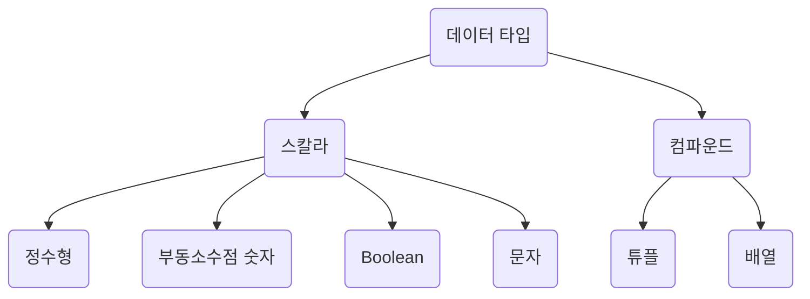

3rd. Common Programming Concepts
=============
[1. Variables and Mutability](#1-변수와-가변성)<br>
[2. Data Types](#2-데이터-타입들)<br>
[3. Functions](#3-함수-동작-원리)<br>
[4. Comments](#4-주석)<br>
[5. Control Flow](#5-제어문)<br>
<br>
<br>
<br>

# 1. 변수와 가변성
* 기본 변수 ➡️ immutable<br>
* 변수가 불변성인 상태에서 값이 바운드 되면 해당 값 변경 불가.<br>
  * 변경 시도하면 컴파일 타임 에러 get!

* <code>mut</code>를 통한 가변성 변수 선언.

* difference between variables and constants<br>
&emsp;1️⃣ 변수에만 <code>mut</code> 사용 ∵ 상수는 불변성 그 자체임❕️<br>
&emsp;2️⃣ 값의 유형 선언: ```variable``` ➡️ <code>let</code>, ```constant``` ➡️ <code>const</code><br>
&emsp;3️⃣ 상수의 제약 조건: 함수 호출의 결과나 실행 중에 결정되는 다른 값은 할당할 수 없음<br>

* shadowing 예시
  ```rust
  fn main() {
    let x = 5;

    let x = x + 1;

    let x = x * 2;

    println!("The value of x is: {}", x);
  }
  ```
  <br>
&emsp;```let``` 키워드로 효율 ⬆️
<br>
* ```let```과 ```mut``` 비교<br><br>
  ```rust
  let spaces = "   ";
  let spaces = spaces.len();
  ```
  ➡️ 공백의 개수가 출력
  <br><br>
  ```rust
  let mut spaces = "   ";
  ```
  ```
  error[E0308]: mismatched types
   --> src/main.rs:3:14
    |
  3 |     spaces = spaces.len();
    |              ^^^^^^^^^^^^ expected &str, found usize
    |
    = note: expected type `&str`
               found type `usize`
  ```
  ➡️ 변수 유형 변경 불가함을 나타냄
<br>
<br>
<br>

# 2. 데이터 타입들

<br>

## 정수형
* 소수점이 없는 숫자
  
* 부호: 숫자가 부호를 가져야 하는 경우 / 미부호: 양수만을 가지기에 부호없이도 표현되는 경우
  * 부호된 숫자는 [2의 보수](https://ko.wikipedia.org/wiki/2%EC%9D%98_%EB%B3%B4%EC%88%98) 형태로 저장.
  
* Rust에서의 정수 타입

<div align="center">

|Length|Signed|Unsigned|
|:------:|:---:|:---:|
|8-bit|i8|u8|
|16-bit|i16|u16|
|32-bit|i32|u32|
|64-bit|i64|u64|
|arch|isize|usize|

</div>

## 부동 소수점 타입
* 기본 타입: ```f64```

* 부동 소수점 숫자 활용 예제

  ```rust
  fn main() {
    let x = 2.0; // f64

    let y: f32 = 3.0; // f32
  }
  ```
  * ```f32```: 1배수의 정밀도인 부동 소수점
  * ```f64```: 2배수의 정밀도인 부동 소수점

## Boolean 타입
* ```true```와 ```false``` 둘 중 하나의 값만 가짐

* ```bool```로 명시

* 조건으로 사용

## 문자 타입
* ```String```은 ```""```, ```char```은 ```''```.

<hr>

## 튜플
* 값들을 집합시켜 튜플화

	```rust
	fn main() {
		let tup: (i32, f64, u8) = (500, 6.4, 1);
	}
	```
		
	```rust
	fn main() {
		let tup = (500, 6.4, 1);
		
		let (x, y, z) = tup;
		
		println!("The value of y is: {}", y);
	}
	```

 * 마침표```.``` 뒤에 index 입력하여 튜플 요소 직접 접근

   ```rust
   fn main() {
	    let x: (i32, f64, u8) = (500, 6.4, 1);
	
	    let five_hundred = x.0;
	
	    let six_point_four = x.1;
	
	    let one = x.2;
	}
	```

## 배열
* 배열의 모든 요소는 <b>같은 타입</b>이어야 함.

* <i><b>panic</b></i>: index가 길이보다 길 경우 프로그램이 오류와 함께 종료됨.
  
# 3. 함수 동작 원리
* 매개 변수 사용
  ```rust
  fn main() {
  	parameter(3, 11);
  }

  fn parameter(x: i32, y: i32) {
  	blahblah
  }
  ```

* 표현식 부
  ```rust
  {
  	let x = 3;
  	x + 1
  }
  ```
  <br>➡️ ```x + 1```이 세미콜론으로 끝난다면❓ 구문으로 변경, 반환 값이 아니게 됨

* 반환 값을 갖는 함수
	* 타입 ```->``` 뒤에 선언
   	* Rust에서 반환값 == 함수 본문 마지막 표현식의 값
   	  ```rust
   	  fn five() -> i32 {
   	  	5
   	  }

   	  fn main() {
   	  	let x = five();

   	  	println!("The value of x is: {}", x);
   	  }
   	  ```
   	  ➡️ 오류 안 남. 제대로 되는 거임.<br><br>
   	  ```rust
   	  let x = 5; //얘랑 같음
   	  ```
<br>
<br>
<br>

# 4. 주석
```rust
fn main() {
	println!("주석이 뭔데!") //이거
}
```
# 5. 제어문	
